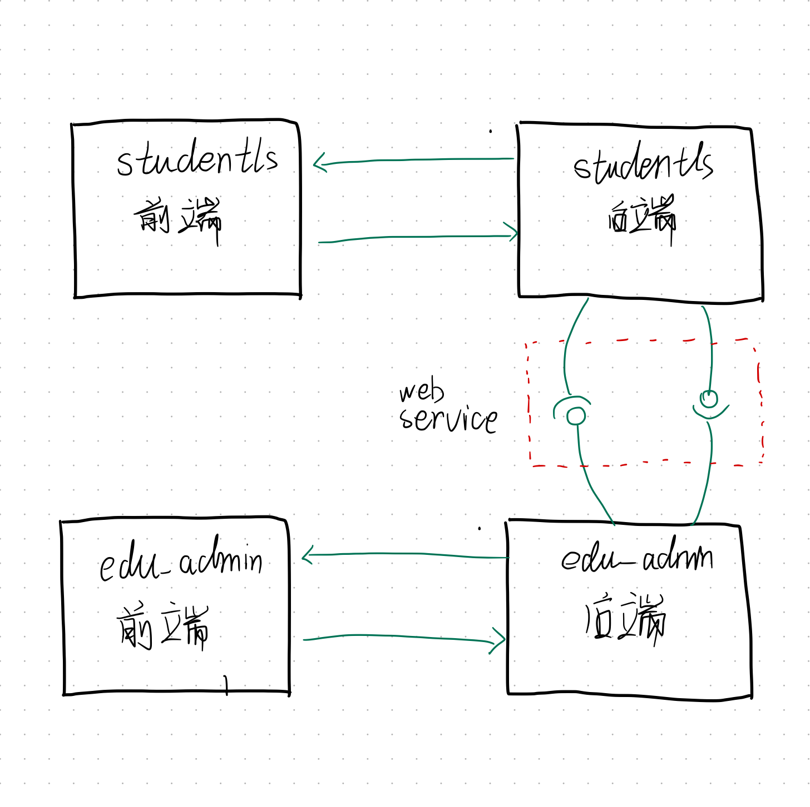
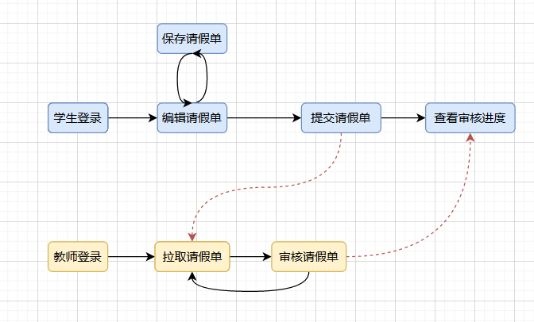
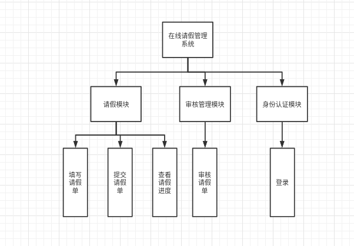
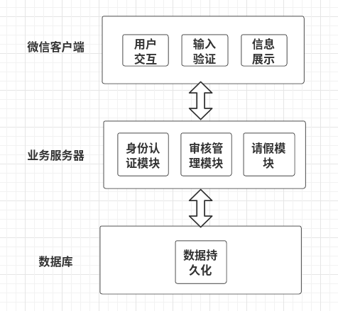
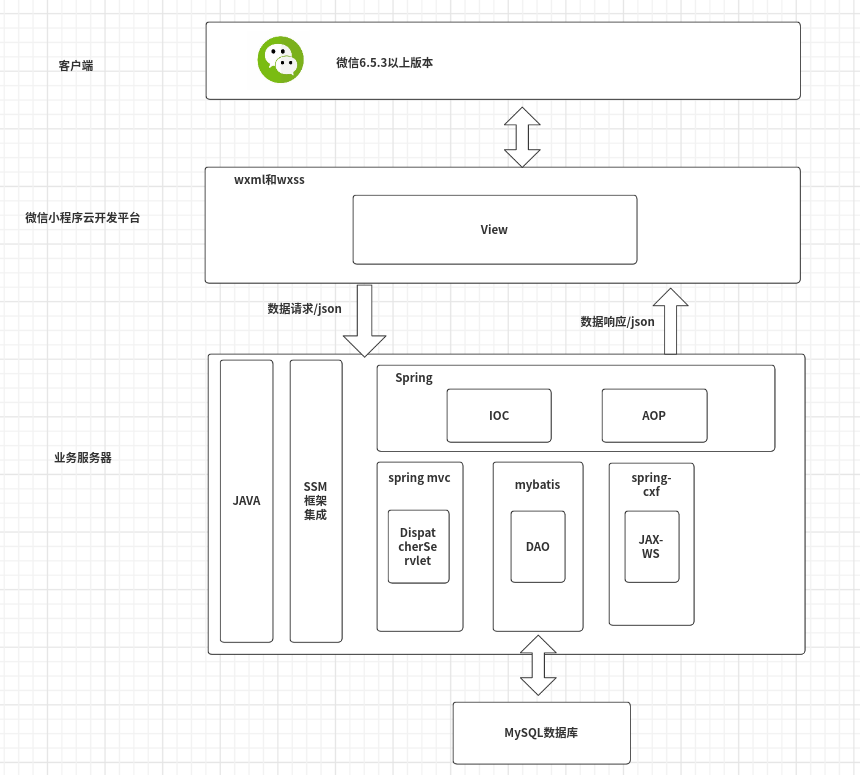
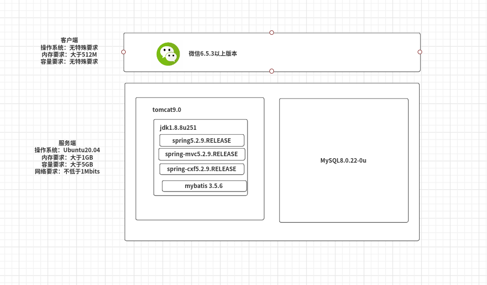
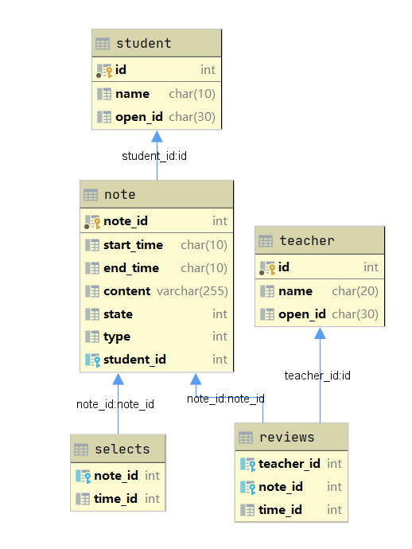

## studentls--在线请假管理系统

### 一、引言

**studenls--在线请假管理系统**为web service体系架构课程的课程大作业，studentls即为student leave school的缩写。

在web service体系结构课程中，课程要求我们以二人为一小组，四人为一大组，开发两个异构系统（技术实现上异构），同时两个异构系统之间需要有信息交互，而信息交互的传递路径是两个系统提供的web service。我们小组决定设计及实现**在线请假管理系统**及**在线教务管理系统**。本仓库为在线请假管理系统的后端实现，前端实现部分见[校园请假系统](https://github.com/Cat1007/EasyRequestForLeave)

两个异构系统间的示意图如下：

### 二、功能演示

- 系统基本流程
  
  

- 已实现主要功能及其演示
  
  - 学生/教师登录认证：如果该微信号未曾登录过该系统，会有一个认证身份的过程
    
    - 学生登录认证
    - 教师登录认证
  
  - 学生编辑请假单、暂时保存请假单、提交请假单
  
  - 学生查看请假进度：包含两部分，一部分是未审核完毕的请假单，一部分是审核完毕的请假单
  
  - 教师审核请假单

### 三、技术选型

由于有<u>异构系统</u>的作业要求，请假系统及教务系统需要需要选取不同的技术框架，但是主要针对的是后端，前端可以采取同样的技术框架。因此选型如下：

| 系统       | 前端         | 后端          | web service |
| -------- | ---------- | ----------- | ----------- |
| 教务管理系统   | 微信小程序，vant | flask+mysql | flask       |
| 在线请假管理系统 | 微信小程序，vant | ssm+mysql   | cxf         |

对与请假管理系统，之所以后端不采用spring boot这些更为方便快捷的框架，是以为该系统需要提供soap风格类型的web service。spring boot太方便简洁了，web service这一块，全面支持restful风格的web service，对于上古产物soap风格的web service，并没有像ssm那样可以直接集成开发。所以最终选择了ssm为请假管理系统的后端开发框架。

### 四、系统设计

在系统设计过程中，为了满足“异构系统之间需要有信息交互”的要求，我们设置了如果规则:

- 在线请假管理系统不保存课程信息，由教务管理系统通过web service提供
- 在线请假管理系统不获取所有用户，仅从教务管理系统获取当前登录的用户的身份信息
- 由于请假涉及的课程需要精确到“<u>第x周 周y 第a-b节</u>”，为了保持统一，在线请假管理系统和教务管理系统设计的数据库中，课程有一个对应的**最小粒度的课程小节id**

#### 4.1 系统功能模块划分

系统的功能模块较为简单，也比较简单，使用树状图一目了然。其中最难实现的部分是审核部分和提交部分，当然登录认证部分也有一点点难度，因为涉及到了微信小程序openid的获取及辨认。

#### 4.2 系统逻辑架构

#### 4.3 系统技术架构

经典ssm，同时项目也是按照MVC设计模式来写的。

#### 4.4 系统物理架构

#### 4.5 系统数据库设计

可以看出，数据库中的表都与系统中的数据实体紧紧联合。

### 五、项目部署

1. 修改`src/main/java/controller/LoginController.java`中的**APPID**和**APPSECRET**为你自己微信小程序的appid和appsecret
2. 创建数据库同时修改` src/main/resources/dbconfig.properties `中的数据库配置
3. 部署到tomcat上

----

实际上，本仓库你并不能直接跑起来，原因很简单：

请假管理系统的数据来源于教务管理系统，你首先的部署好教务管理系统，然后请假管理系统才可以获取到初始的用户身份数据和课程数据。没有这两部分数据，请假功能模块也就跑不起来了。

但是你可以查看旧仓库[studentls-old](https://github.com/tivnan/studentls-old)，在旧仓库，并未直接接入教务系统的web service，身份数据和课程数据包含在请假单数据库中。**理论上**studenls-old通过部署可以直接跑起来，不过不要抱太大希望。因为studentls-old存在很多问题，比如分支管理混乱，代码耦合高，注释混乱等等。